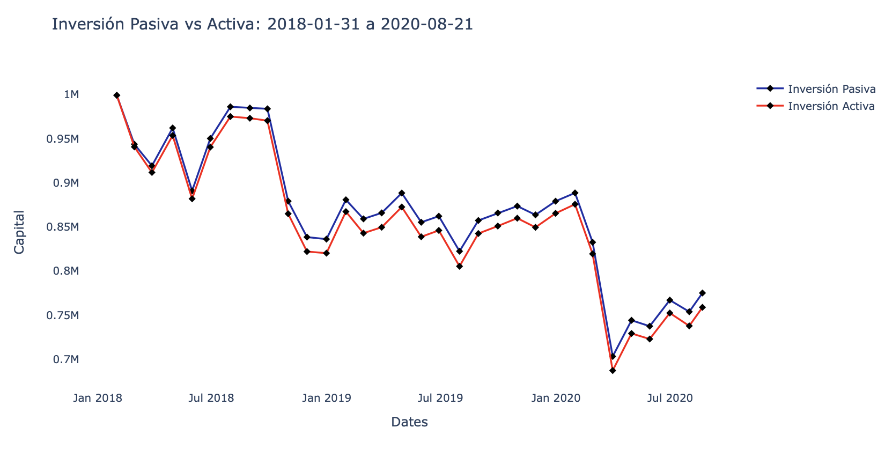
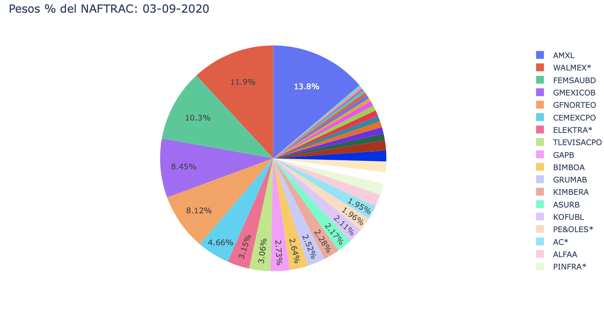

# Lab 1: Capital Investment

## Purpose and Expected Results
*To be able to answer the question: What investment strategy would you propose if your job were to manage 1 Million pesos?*

Case: You have 1 million pesos, you have two options to invest them. On the one hand, you can make a Passive Investment of the capital, buying 100% of the capital of securities of an ETF that replicates the Mexican equity market S&P / BMV IPC, which is NAFTRAC. But on the other hand, you can make an Active Capital Investment, by creating a portfolio that has the same assets as the ETF and rebalancing through a specific algorithm.

For a defined period, obtain 2 time series. The first is the evolution of the capital of your Passive Investment strategy, and the second is the evolution of the capital of your Active Investment strategy. Also, a table with the history of all the operations that are carried out in your Active Investment strategy, and a comparative table with Performance Attribution Metrics, to have a financial comparison between both investment strategy options.

## Install dependencies

Install all the dependencies stated in the requirements.txt file, just run the following command in terminal:

        pip install -r requirements.txt
        
Or you can manually install one by one using the name and version in the file.

## Funcionalities

With this project, using the __[**iShares NAFTRAC**](https://www.blackrock.com/mx/intermediarios/productos/251895/ishares-naftrac-fund) historic files__ from 2018 to 2020 and __Yahoo Finance__ prices for the NAFTRAC's Mexican stocks, you can compare what would be your capital using a Passive Investment strategy vs using an Active Investment strategy:



Also, you can track the ETF's weights, the NAFTRAC, to the last business day:



And which are the main sectors in this ETF of Mexican stocks.


For more information and usages, please observe the [Jupyther Notebook](notebook.ipynb)

##### <font color= #6B6B6B> <font size = 2> Note: This Notebook is in Spanish. </font>
        
##### <font color= #6B6B6B> <font size = 2> Note 2: The files should be named __'NAFTRAC_YYMMDD.csv'__ to work properly. </font>

***

### To get the pasive investment:
```commandline
$ python main.py pasive --show
```
- show is a boolean to determine if fig.show() should be called.

### To get the active investment:
```commandline
$ python main.py active --show
```
- show is a boolean to determine if fig.show() should be called.

### To get the active investment operations history:
```commandline
$ python main.py active_movs
```

### To get the investment comparation:
```commandline
$ python main.py compare
```

### To get the Performance Attribution Measures:
```commandline
$ python main.py measures
```

***

#### Scripts on this project:

- __data__.py: Data import from NAFTRAC files.

- __functions__.py: Data manipulation.

- __visualizations__.py: Data visualization, as graphs or final DataFrames.

- __main.py__: Main python file. Where the functions from other files are called and run.

- __notebook.ipynb__: Jupyter notebook with some explanations and usages shown previously above.

## Author
Oscar Alfonso Flores Orozco.

Financial Engineer at ITESO.

Global Implementation Analyst at Herbalife Nutrition Mexico.

Guadalajara, México.

## License
**GNU General Public License v3.0** 

*Permissions of this strong copyleft license are conditioned on making available 
complete source code of licensed works and modifications, which include larger 
works using a licensed work, under the same license. Copyright and license notices 
must be preserved. Contributors provide an express grant of patent rights.*

## Contact
*For more information in reggards of this repo, please contact me by email if710183@iteso.mx or [LinkedIn](https://www.linkedin.com/in/oscar-alfonso-flores-orozco/)*
